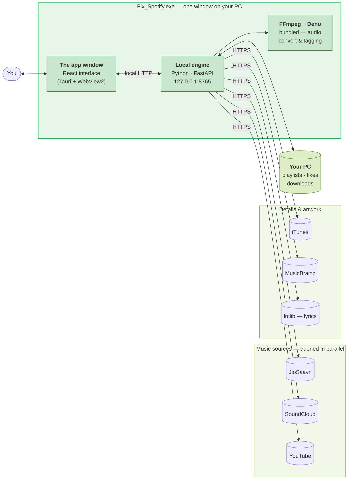
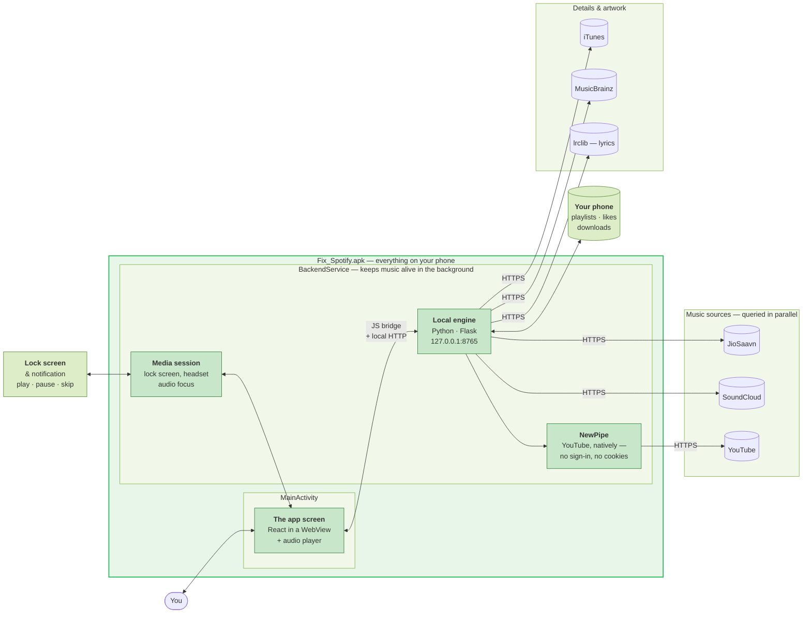

# Fix_Spotify — User Guide

**Everything you can do with the app, in plain language.**

Windows `.exe` · Android `.apk` · One music library, three sources, no account.

---

> **New here?** Read [What is this?](#what-is-this) and [Getting the app](#getting-the-app), then jump
> straight to [Things you'll want to know](#things-youll-want-to-know) — that section is where the
> app stops feeling like a search box and starts feeling like a music player.

## Contents

- [What is this?](#what-is-this)
- [Getting the app](#getting-the-app)
- [How it's put together](#how-its-put-together)
  - [The Windows app (.exe)](#the-windows-app-exe)
  - [The Android app (.apk)](#the-android-app-apk)
- [Things you'll want to know](#things-youll-want-to-know)
  - [Paste a Spotify link into the search bar](#paste-a-spotify-link-into-the-search-bar)
  - [Double-tap to skip forward or back](#double-tap-to-skip-forward-or-back)
  - [Swipe the mini player to change song](#swipe-the-mini-player-to-change-song)
  - [The equalizer](#the-equalizer)
  - [Lyrics that follow the song](#lyrics-that-follow-the-song)
- [Finding music](#finding-music)
- [Your library](#your-library)
- [Sound and quality](#sound-and-quality)
- [Downloads and offline](#downloads-and-offline)
- [Settings, briefly](#settings-briefly)
- [Troubleshooting](#troubleshooting)
- [Fair use](#fair-use)

---

## What is this?

Fix_Spotify searches **JioSaavn**, **SoundCloud** and **YouTube** at the same time, merges everything
into one clean list, and lets you play or download any of it.

The parts that matter to you:

- **No account.** Nothing to sign up for, nothing to log into.
- **No server.** Everything runs on your own device.
- **No telemetry.** Your library and your listening stay on your machine.
- **One song, one row.** If a track exists on three sources, you see it once — the app quietly keeps
  the other two as backups.

That last point is the one people notice. When a stream dies, is region-blocked, or is DRM-locked,
the app falls back to the next source instead of throwing an error at you. Music keeps playing.

---

## Getting the app

Both downloads live on the **[Releases](https://github.com/AshirwadRai/Fix-Spotify/releases/latest)**
page. You don't need to build anything.

| You want | Download | Runs on |
| --- | --- | --- |
| Windows | `Fix_Spotify_x.x.x_x64-setup.exe` | Windows 10 / 11 |
| Android | `Fix_Spotify-x.x.x.apk` | Android 8.0+ (`arm64-v8a`) |

**On Windows**, run the installer and launch it from the Start Menu. Windows may show a SmartScreen
warning because the installer isn't code-signed — choose **More info → Run anyway**.

**On Android**, allow installs from your browser or file manager when prompted.

> ### ⚠️ Updating on Android — read this one
>
> Install the new APK **over** the old app. **Do not uninstall first.** Android wipes app data on
> uninstall, and that takes your playlists, liked songs and history with it. Installing over the top
> keeps everything.

---

## How it's put together

You don't need any of this to use the app. It's here because people ask *"where does the music
actually come from?"* — and the answer is: your own device asks the sources directly. Nothing goes
through us.

### The Windows app (.exe)

**In one line:** the window you see and a small Python engine ship inside the same installer. The
window asks the engine, the engine asks the music sources, and your library is written to your own
disk. FFmpeg and Deno come bundled — you never install them.

### The Android app (.apk)

**In one line:** the same interface and the same engine, packed into the APK. Music survives you
switching apps or locking the phone because the engine runs as a foreground service — that's the
notification you see while playing, and Android requires it. YouTube is handled by NewPipe directly
on the device, which is why it needs no sign-in and no cookies.

**Same brain, two bodies.** Both editions share one backend and one React codebase. A fix to search
or downloads lands on your PC and your phone at the same time.

---

## Things you'll want to know

### Paste a Spotify link into the search bar

Copy any Spotify **playlist**, **album** or **track** link and paste it into the search bar. The app
recognises it isn't a search, and imports it instead.

| You paste | What happens |
| --- | --- |
| A playlist or album link | Every track is matched against the sources and saved as a playlist you own |
| A single track link | It resolves and plays |

Works in both editions — the search bar on Windows, the Search tab on Android. `spotify:` URIs work
just as well as `https://open.spotify.com/...` links.

The app reads the public tracklist and finds each song on JioSaavn, SoundCloud or YouTube. Fuzzy
matching handles the usual mess — remixes, live versions, "feat." spellings that never agree.

> **Nice side effect:** your imported playlist keeps working even when a source doesn't. Each track
> carries its alternates.

### Double-tap to skip forward or back

Open the full player (tap the mini player to expand it), then **double-tap the artwork**:

- **Left half** → back 10 seconds
- **Right half** → forward 10 seconds

Keep tapping while the ripple is still on screen and it **stacks**: `−10 → −20 → −30`. Single taps
count once the chain has started, so you don't have to keep double-tapping. A soft half-disc lights
up from the tapped edge and shows the running total, YouTube-style.

That intro you always skip is two taps away.

### Swipe the mini player to change song

On the mini player at the bottom, **swipe left for the next song, right for the previous one**. No
need to expand anything or aim for a small button.

The bar figures out whether you meant to swipe sideways or scroll the page from the first few pixels
of movement, then commits — so it fires reliably even if your thumb drifts.

### The equalizer

Eight bands, from sub-bass (60 Hz) to air (16 kHz), with **eleven presets** and a custom curve:

| | | |
| --- | --- | --- |
| Flat | Rock | Metal |
| Pop | Hip-Hop | Electronic |
| Classical | Jazz | Vocal |
| Bass Boost | Treble Boost | **Custom** |

Pick a preset, or drag the sliders and the app remembers your curve as **Custom**. Changes are
audible immediately — no restart, no re-buffer.

**Why it sounds clean:** gains are clamped to ±12 dB on purpose. A stream is already near full
volume, so a 15 dB boost wouldn't make it louder — it would clip and distort. Staying inside the
ceiling is what keeps a heavy Bass Boost punchy instead of muddy. Eight bands rather than ten is a
deliberate call too: on a phone, ten sliders means ten targets too small to grab, and at these Q
values the extra two buy almost nothing.

### Lyrics that follow the song

Lyrics come from **lrclib**, and when a synced version exists they scroll **line by line, in time
with the music**. **Tap any line to jump to that moment** in the song — the fastest way to replay a
verse. When only plain lyrics exist, you get the full text.

---

## Finding music

**Search** queries all enabled sources in parallel and merges the results, so one song is one row
carrying every source it's available from. A badge tells you where a track is coming from.

| Source | Status | What it's good for |
| --- | --- | --- |
| **JioSaavn** | Always on | The main catalogue — up to 320 kbps |
| **SoundCloud** | Always on | Remixes, DJ sets, independent uploads |
| **YouTube** | Opt-in | Everything else — rarities, live sets, covers |

**Turning on YouTube** (Settings → Sources): on Android the app runs a real self-test on your
device — it resolves an actual audio stream — and only switches the source on if that works. It will
never claim YouTube works on a phone where it doesn't.

**Browse tiles** on the Home tab are curated featured playlists from JioSaavn, themed by mood, genre
and decade — a starting point for when you don't have a song in mind.

**Radio / autoplay** is the other half of that. As your queue runs low, it tops itself up with
similar tracks (via Last.fm's collaborative filtering, resolved against whichever sources you have
enabled). Start with one song you like and the app keeps the mood going on its own.

**The queue** behaves the way you'd hope: songs you add by hand form a block at the head of the
queue, in the order you added them, and *Play next* jumps that block. On Android you can **drag
queue items** to reorder them.

---

## Your library

- **Playlists, liked songs, saved albums and artists** — the usual, all stored on your device.
- **Pin up to five** playlists or albums to the top of your library.
- **Long-press a track** (Android) for a menu — add to playlist, play next, download, go to artist.
- **Multiple artists?** Tap the artist name and pick which one to open.
- **Resume.** The app reopens on the song and timestamp you left, paused.

Clean names and high-resolution cover art come from the **iTunes Search API** and **MusicBrainz**, so
you get proper artist, album, genre and release date instead of `Song_Name_320kbps_FINAL(2)`.

---

## Sound and quality

| Setting | What it does |
| --- | --- |
| **Streaming bitrate** | Auto · Normal · High · Very High |
| **Crossfade** | 0–12 s — one song melts into the next |
| **Normalize volume** | Evens out loudness so a quiet track doesn't vanish after a loud one |
| **Equalizer** | Eight bands + presets — [see above](#the-equalizer) |
| **Quality / source badges** | Show or hide the little labels on each row |

---

## Downloads and offline

Downloads are queued and tagged. **A download embeds exactly what the player shows you** — same
artist, same album, same artwork — so your files land in your music folder already correct, and play
in any other player.

- **Windows** — audio is converted with the bundled FFmpeg.
- **Android** — the original container is kept as-is (no transcode, no quality loss, faster).
- **Change where downloads go** in Settings → Storage.

Downloaded songs play with no connection at all.

---

## Settings, briefly

| Section | What's in it |
| --- | --- |
| **Playback** | Autoplay, crossfade, overlap |
| **Sound** | Equalizer, presets, normalize volume, media quality |
| **Sources** | JioSaavn, SoundCloud, YouTube toggle + self-test |
| **Storage** | Download folder, reset to default |
| **Updates** | Check for a new version (Android installs it in place) |

---

## Troubleshooting

**A song won't play.**
It usually just falls back to another source on its own. If it doesn't, the track may only exist on a
source you have switched off — try enabling YouTube in Settings → Sources.

**Music stops when I leave the app (Android).**
Check that the Fix_Spotify notification is showing. That's the foreground service keeping playback
alive; if your phone's battery optimiser killed it, allow the app to run in the background.

**YouTube won't turn on (Android).**
The self-test resolves a real stream and it failed on your device — usually a network block. Try
again on a different connection.

**Windows says the app is unsafe.**
The installer isn't code-signed. **More info → Run anyway**.

**Windows wants WebView2 on first launch.**
It's a ~2 MB Microsoft runtime, and it ships with Windows 11 and recent Windows 10. Let it install.

**I lost my playlists after updating my phone.**
The APK was uninstalled rather than installed over. Android wipes app data on uninstall — always
install the new APK on top of the old one.

---

## Fair use

This app is **for educational and personal use only**. It doesn't host, store or distribute any
copyrighted content — it plays what the public sources already serve.

**Support the artists you love: buy their music, and use official streaming services.**

Licensed under **GPL v3** — see [LICENSE](../LICENSE).

---

Building or contributing? See the **[README](../README.md)** and **[mobile/GUIDE.md](../mobile/GUIDE.md)**.

