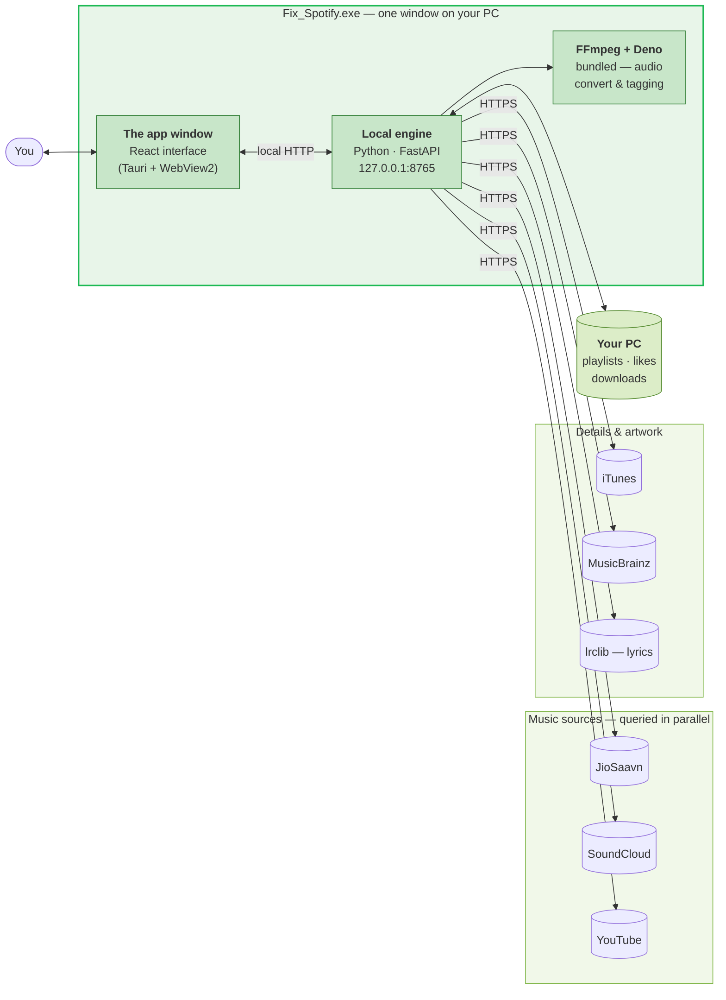
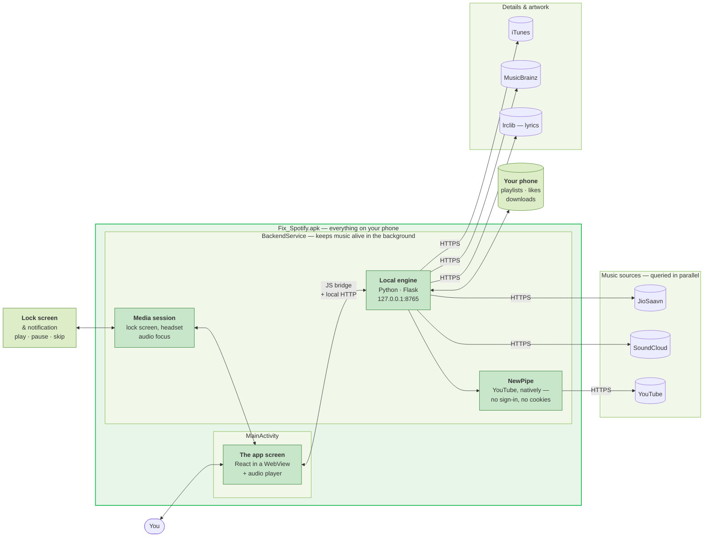

# How It Works

You don't need any of this to use the app.

It's here because people ask *"where does the music actually come from?"* — and the answer is: **your own device asks the sources directly**. Nothing goes through us, because there is no us to go through. There's no server.

## The Windows app (.exe)

**In one line:** the window you see and a small Python engine ship inside the same installer. The window asks the engine, the engine asks the music sources, and your library is written to your own disk.

FFmpeg and Deno come bundled — you never install them.

## The Android app (.apk)

**In one line:** the same interface and the same engine, packed into the APK.

Music survives you switching apps or locking the phone because the engine runs as a **foreground service** — that's the notification you see while playing, and Android requires it for background audio.

YouTube is handled by **NewPipe** directly on the device, which is why it needs no sign-in and no cookies.

## Same brain, two bodies

Both editions share **one backend and one React codebase**. A fix to search or downloads lands on your PC and your phone at the same time.

The parts that differ are only the parts that have to: how the window is created, how audio is kept alive in the background, and how YouTube is reached.

## What this means for you

- **Nothing is uploaded.** There's no account and no server, so there's nowhere to upload to.
- **Your library is a local file.** Backing up your device backs up your music library.
- **The app works as well as your connection does** — it's talking to the sources directly, not to a middle layer that might be down.

---

Related: **[Introduction](/guide/introduction)** · **[Troubleshooting](/reference/troubleshooting)**
